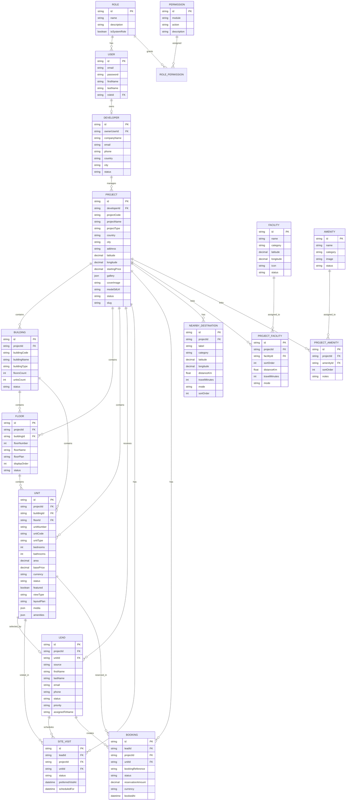

# ERD

This ERD is based on `apps/api/prisma/schema.prisma`.

## Relationship Notes

- `Developer` owns many `Project` records.
- `Project` is the parent record for buildings, floors, units, leads, bookings, visits, nearby destinations, POIs, and amenities.
- `Building` owns floors and units within a project.
- `Floor` owns units within a building.
- `Lead` can optionally point to a unit and can spawn site visits and bookings.
- `ProjectFacility` and `ProjectAmenity` are join tables that connect master data to a specific project.

